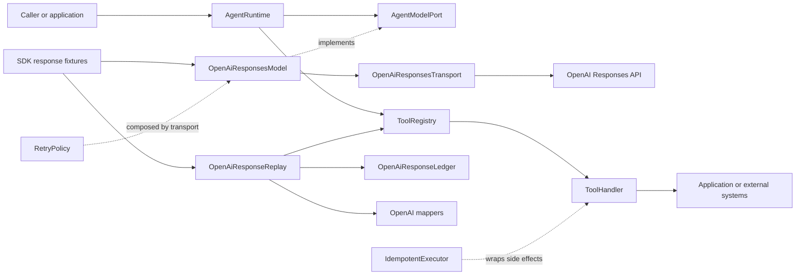
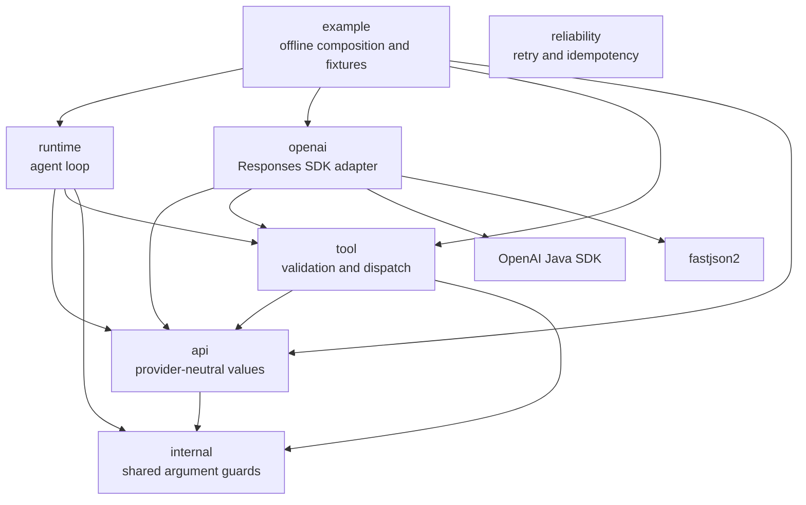
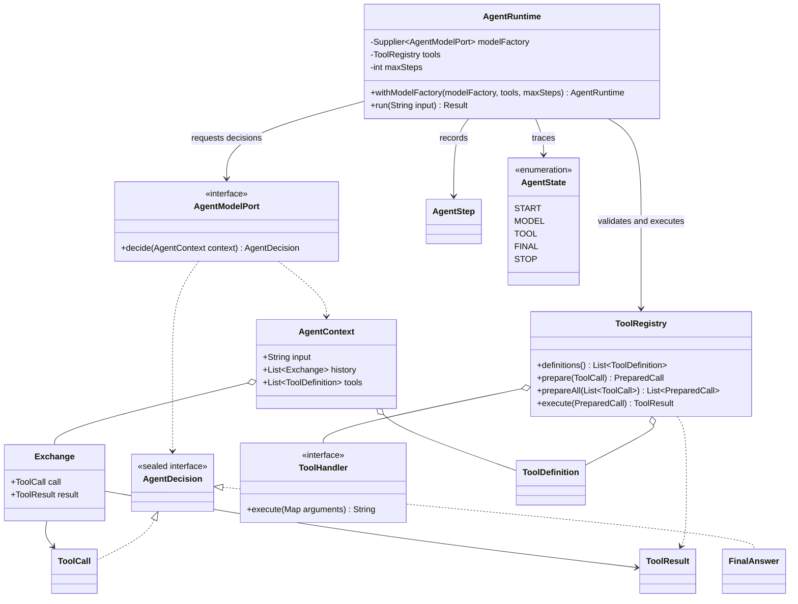
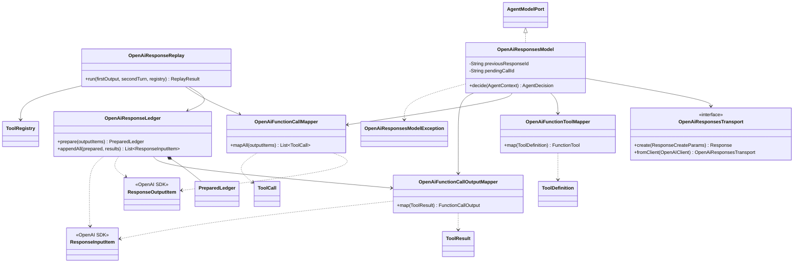
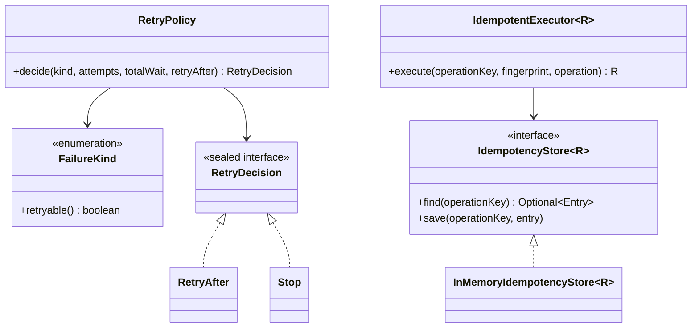
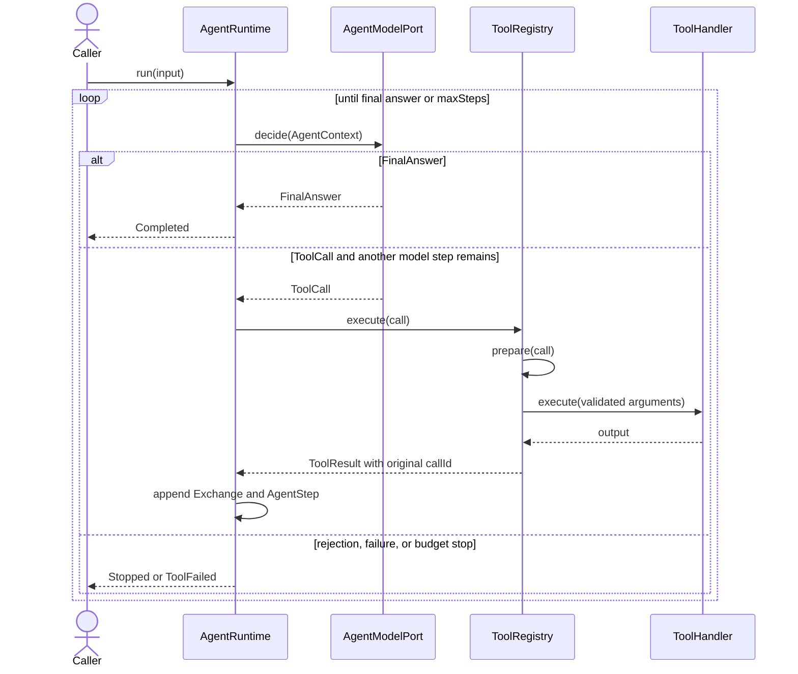
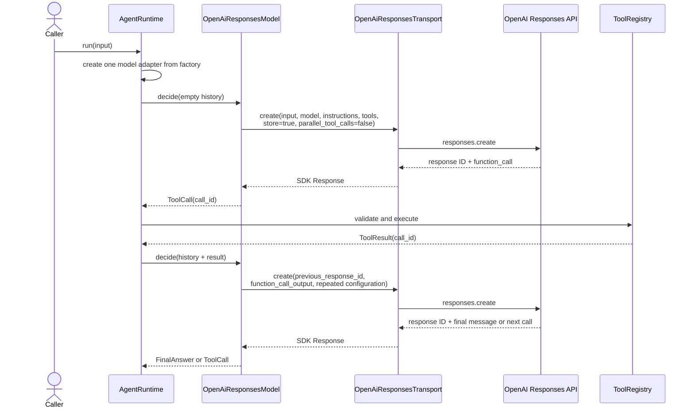
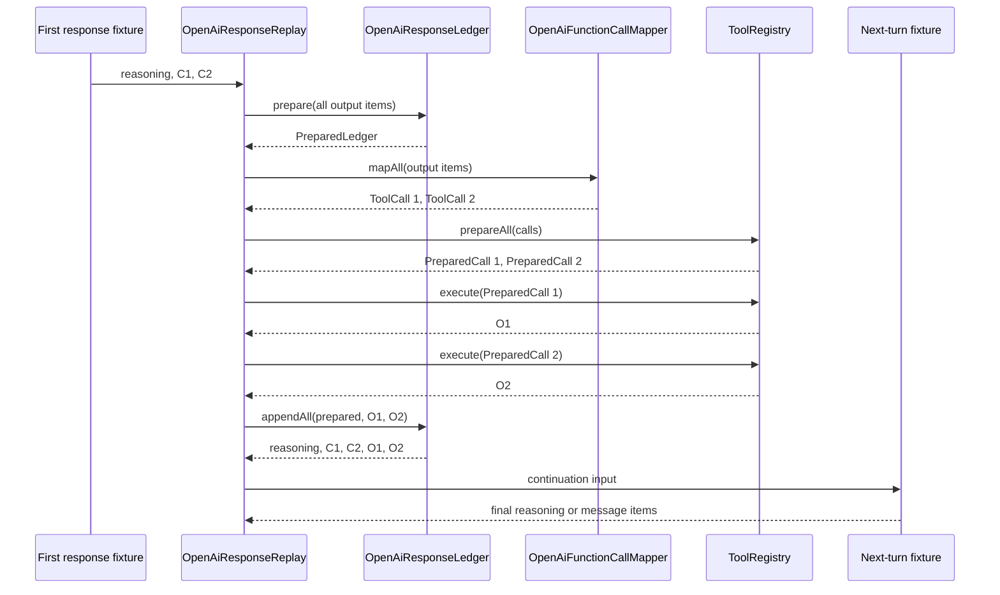

# Architecture, classes, and call paths

[English](architecture.md) | [简体中文](architecture.zh-CN.md)

This document is the current structural map of the codebase. ADRs explain why durable decisions were made; this document explains what exists now and must change with the code.

## System context

The blocking SDK transport path is implemented. Default tests replace the network edge with captured requests and SDK response fixtures, so live service compatibility remains unverified. `OpenAiResponseReplay` separately exercises manual heterogeneous-output preservation and deterministic multi-call batches.

## Package dependency direction

`api`, `runtime`, `tool`, and `reliability` must remain free of OpenAI SDK types. `reliability` is intentionally policy-only and is composed at transport or handler boundaries rather than imported by the core loop.

## Provider-neutral runtime classes

### Runtime class catalog

| Class | Function | Important relationships |
| --- | --- | --- |
| [`AgentContext`](../src/main/java/io/github/jamielu/agent/api/AgentContext.java) | Immutable input, successful tool history, and exposed tools for one model decision. | Contains `Exchange`; consumed by `AgentModelPort`. |
| [`AgentDecision`](../src/main/java/io/github/jamielu/agent/api/AgentDecision.java) | Closed model decision: `FinalAnswer` or one provider-neutral `ToolCall`. | Produced by `AgentModelPort`; consumed by `AgentRuntime`. |
| [`AgentState`](../src/main/java/io/github/jamielu/agent/api/AgentState.java) | Observable runtime lifecycle states. | Appended by `AgentRuntime`. |
| [`AgentStep`](../src/main/java/io/github/jamielu/agent/api/AgentStep.java) | One model decision plus an optional matching successful tool observation. | Returned in runtime results. |
| [`ToolDefinition`](../src/main/java/io/github/jamielu/agent/api/ToolDefinition.java) | Provider-neutral tool name, description, and ordered required string parameters. | Registered in `ToolRegistry`; mapped by `OpenAiFunctionToolMapper`. |
| [`ToolResult`](../src/main/java/io/github/jamielu/agent/api/ToolResult.java) | Tool output correlated by the original `callId`. | Stored in history; mapped to `function_call_output`. |
| [`AgentModelPort`](../src/main/java/io/github/jamielu/agent/runtime/AgentModelPort.java) | Boundary for one model decision. | Implemented by `OpenAiResponsesModel` and fixture adapters. |
| [`AgentRuntime`](../src/main/java/io/github/jamielu/agent/runtime/AgentRuntime.java) | Drives the bounded model-tool-model loop and returns typed terminal results. | Obtains one `AgentModelPort` from its factory per run and uses `ToolRegistry`. |
| [`ToolRegistry`](../src/main/java/io/github/jamielu/agent/tool/ToolRegistry.java) | Allowlist, exact argument validation, side-effect-free batch preflight, dispatch, and call/result correlation. | Owns `Registration` and `PreparedCall`; invokes `ToolHandler`. |
| [`ToolHandler`](../src/main/java/io/github/jamielu/agent/tool/ToolHandler.java) | Executes already-validated application logic. | Registered in `ToolRegistry`. |
| [`ToolExecutionException`](../src/main/java/io/github/jamielu/agent/tool/ToolExecutionException.java) | Typed expected handler failure. | Converted to `AgentRuntime.ToolFailed`. |

## OpenAI Responses adapter classes

### OpenAI adapter class catalog

| Class | Function | Important relationships |
| --- | --- | --- |
| [`OpenAiFunctionToolMapper`](../src/main/java/io/github/jamielu/agent/openai/OpenAiFunctionToolMapper.java) | Maps `ToolDefinition` to strict OpenAI `FunctionTool` schema. | Outbound definition boundary. |
| [`OpenAiFunctionCallMapper`](../src/main/java/io/github/jamielu/agent/openai/OpenAiFunctionCallMapper.java) | Parses all SDK function calls and string-only JSON arguments in response order. | Produces provider-neutral `ToolCall` values. |
| [`OpenAiFunctionCallMappingException`](../src/main/java/io/github/jamielu/agent/openai/OpenAiFunctionCallMappingException.java) | Stable mapping failure categories. | Raised before tool execution. |
| [`OpenAiFunctionCallOutputMapper`](../src/main/java/io/github/jamielu/agent/openai/OpenAiFunctionCallOutputMapper.java) | Maps `ToolResult` to SDK `function_call_output`. | Preserves original `callId`. |
| [`OpenAiResponseLedger`](../src/main/java/io/github/jamielu/agent/openai/OpenAiResponseLedger.java) | Preserves and validates reasoning, assistant message, and function-call protocol history. | Creates `PreparedLedger`; appends mapped results. |
| [`OpenAiResponseLedgerException`](../src/main/java/io/github/jamielu/agent/openai/OpenAiResponseLedgerException.java) | Stable fail-closed protocol errors. | Prevents unsafe continuation. |
| [`OpenAiResponseReplay`](../src/main/java/io/github/jamielu/agent/openai/OpenAiResponseReplay.java) | Orchestrates one offline tool batch and one required final continuation. | Composes ledger, call mapper, and registry. |
| [`OpenAiResponsesTransport`](../src/main/java/io/github/jamielu/agent/openai/OpenAiResponsesTransport.java) | Minimal blocking Responses create boundary with an `OpenAIClient` bridge. | Injected into the live model adapter and replaced by captures in offline tests. |
| [`OpenAiResponsesModel`](../src/main/java/io/github/jamielu/agent/openai/OpenAiResponsesModel.java) | Stateful per-run `AgentModelPort` using `previous_response_id`; repeats configuration and disables parallel calls. | Builds SDK requests through the transport and maps responses to core decisions. |
| [`OpenAiResponsesModelException`](../src/main/java/io/github/jamielu/agent/openai/OpenAiResponsesModelException.java) | Stable failures for invalid IDs, terminal output, and continuation context. | Raised before unsafe continuation or accepting an invalid final answer. |

## Reliability classes

| Class | Function | Production extension point |
| --- | --- | --- |
| [`FailureKind`](../src/main/java/io/github/jamielu/agent/reliability/FailureKind.java) | Provider-neutral retry classification. | Add a transport-specific error classifier outside this package. |
| [`RetryPolicy`](../src/main/java/io/github/jamielu/agent/reliability/RetryPolicy.java) | Pure bounded exponential backoff, `Retry-After`, jitter, and wait-budget decisions. | A scheduler performs waits and attempts. |
| [`RetryDecision`](../src/main/java/io/github/jamielu/agent/reliability/RetryDecision.java) | Closed `RetryAfter` or `Stop` result. | Transport loop consumes it. |
| [`IdempotencyStore`](../src/main/java/io/github/jamielu/agent/reliability/IdempotencyStore.java) | Storage port for successful operation results and request fingerprints. | Implement with durable transactional storage. |
| [`InMemoryIdempotencyStore`](../src/main/java/io/github/jamielu/agent/reliability/InMemoryIdempotencyStore.java) | Deterministic process-local store. | Replace for concurrency, persistence, or recovery. |
| [`IdempotentExecutor`](../src/main/java/io/github/jamielu/agent/reliability/IdempotentExecutor.java) | Replays the first success and rejects key/fingerprint conflicts. | Wrap side-effecting handlers. |

## Generic Agent Runtime call path

## Stateful Responses Runtime path

Each Runtime run owns one stateful adapter. Context mismatches, unsupported output items, multiple function calls, blank response IDs, and missing final text fail closed. The transport-to-service messages describe the production bridge; default tests stop at the injected transport and make no network call.

## Responses batch continuation path

No handler can run before protocol validation, mapping, and complete batch preflight succeed. Execution remains serial and non-transactional.

## Change-impact map

| Change | Primary code | Required documentation and tests |
| --- | --- | --- |
| Add an API value or decision type | `api`, then `runtime` consumers | Core class diagram, class catalog, runtime tests, and a new ADR if the abstraction changes. |
| Add a provider | New adapter package | Package graph, adapter diagram, contract tests; keep core packages provider-neutral. |
| Add a tool argument type | `ToolDefinition`, registry validation, provider mappers | Tool ADR, schema tests, invalid-input tests, and both READMEs. |
| Evolve the live OpenAI transport | `OpenAiResponsesTransport` and `OpenAiResponsesModel` | Stateful sequence, ADR-0007, retry/error-classification tests, credential and cost guidance. |
| Add parallel tool execution | New execution policy around `PreparedCall` | Ordering/failure ADR, sequence diagram, race and partial-failure tests. |
| Add durable idempotency | `IdempotencyStore` implementation | Deployment architecture, transaction semantics ADR, crash/concurrency tests. |
| Add streaming or structured final output | OpenAI transport/decoder layer | ADR-0005 successor or extension, terminal-state diagrams, incomplete/refusal tests. |

## Source of truth and update rule

- Java source and executable tests define behavior.
- This architecture document describes the current shape and changes with the code.
- ADRs preserve the reason for durable decisions and are superseded rather than rewritten.
- Mermaid identifiers should remain stable where possible so future diffs show architectural change rather than diagram churn.
- Every structural code review should check the package graph, affected class catalog row, affected sequence, and the corresponding Chinese document.

## Official references

- [OpenAI Agents SDK vs. Responses API](https://developers.openai.com/api/docs/guides/agents#agents-sdk-vs-responses-api)
- [OpenAI Function calling](https://developers.openai.com/api/docs/guides/function-calling)
- [OpenAI Reasoning models](https://developers.openai.com/api/docs/guides/reasoning)
