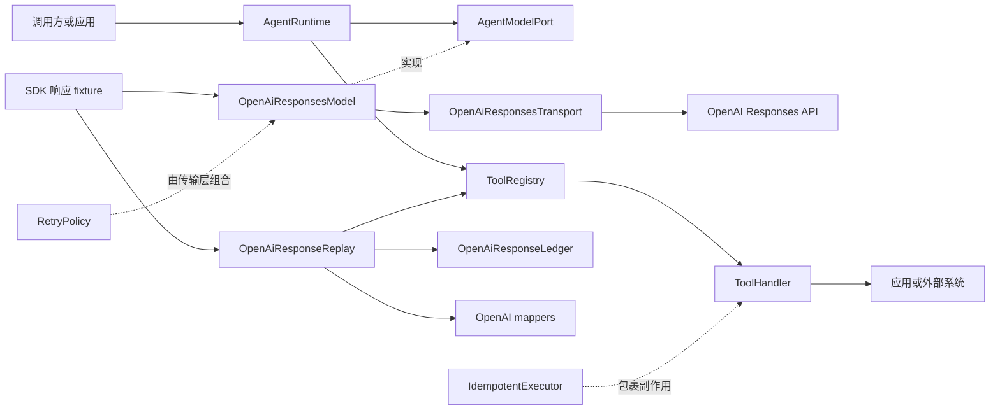
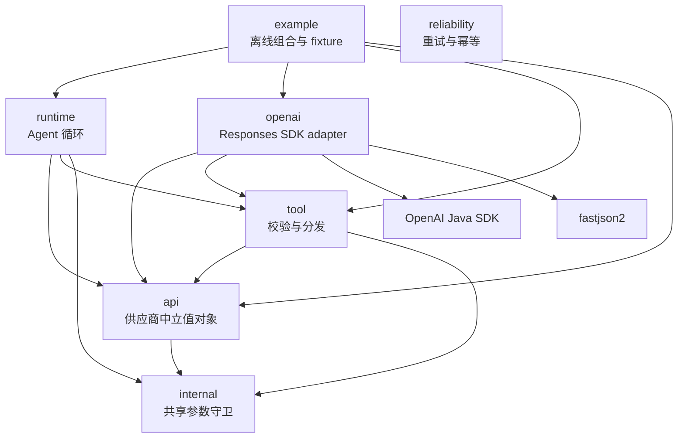
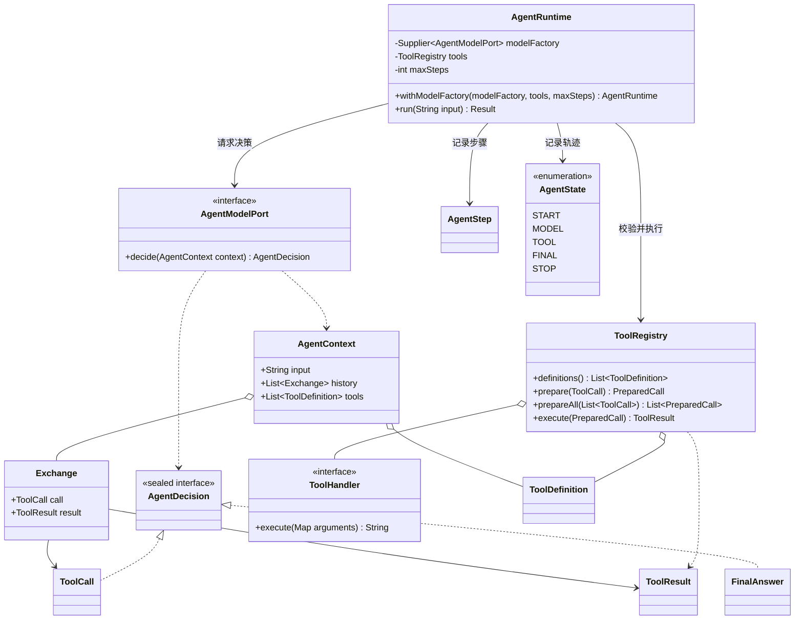
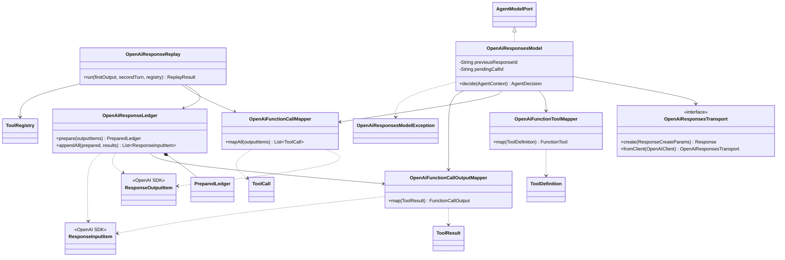
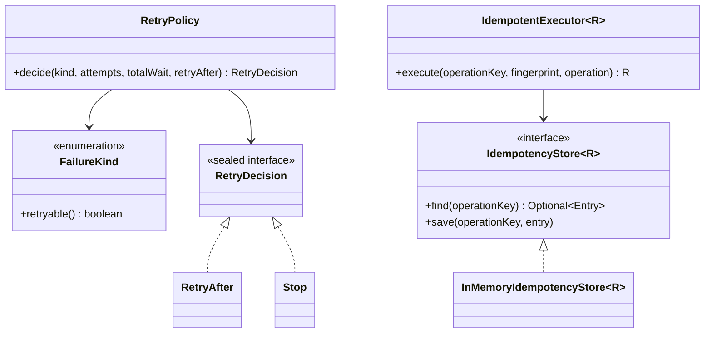
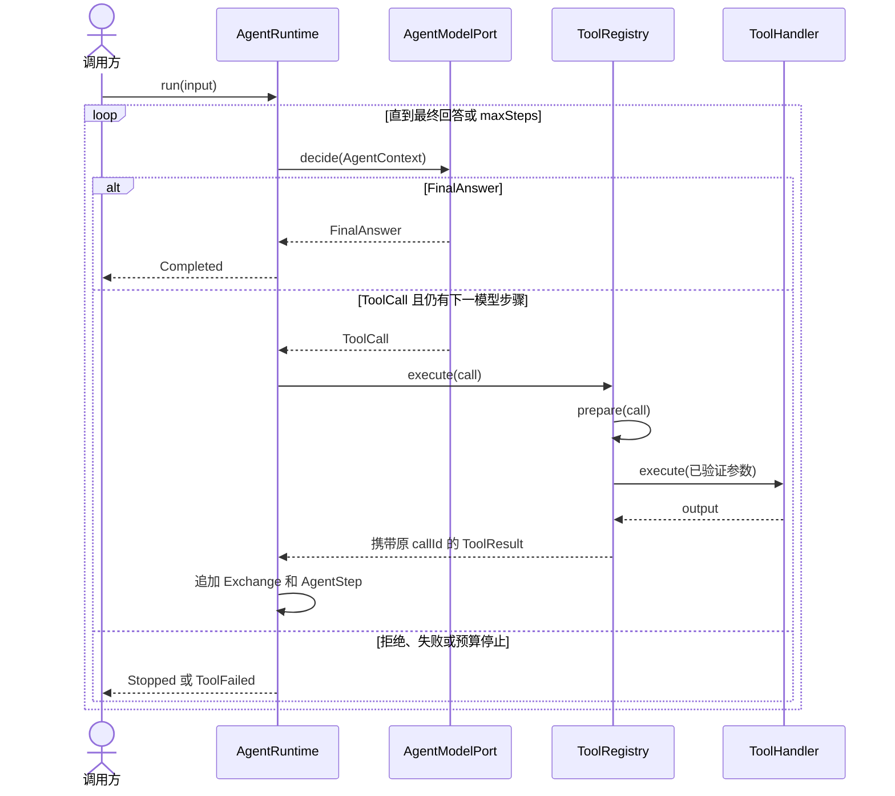
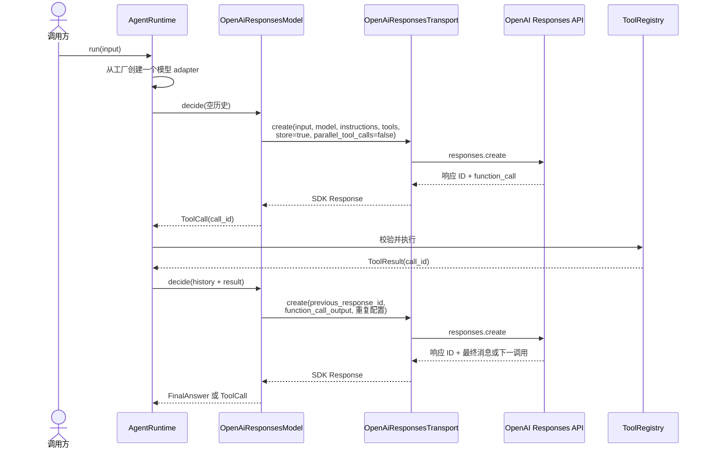
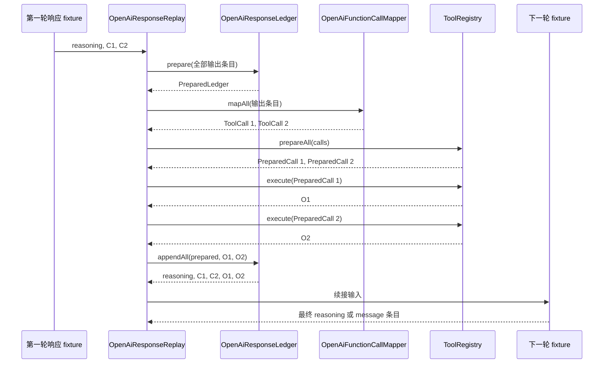

# 项目架构、类职责与调用链路

[English](architecture.md) | [简体中文](architecture.zh-CN.md)

本文档是代码库当前结构的地图。ADR 解释长期决策为什么形成；本文档说明当前实际存在的结构，并且必须随代码同步变化。

## 系统上下文

阻塞式 SDK transport 链路已经实现。默认测试使用捕获请求和 SDK 响应 fixture 替换网络边，因此实时服务兼容性仍未验证。`OpenAiResponseReplay` 独立验证手动保留异构输出和确定性多调用批次。

## 包依赖方向

`api`、`runtime`、`tool` 和 `reliability` 必须保持不含 OpenAI SDK 类型。`reliability` 被刻意设计为纯策略包，应由传输层或 handler 边界组合，而不是由核心循环直接依赖。

## 供应商中立 Runtime 类

### Runtime 类目录

| 类 | 功能 | 重要关联 |
| --- | --- | --- |
| [`AgentContext`](../src/main/java/io/github/jamielu/agent/api/AgentContext.java) | 保存一次模型决策的不可变输入、成功工具历史和公开工具。 | 包含 `Exchange`；由 `AgentModelPort` 消费。 |
| [`AgentDecision`](../src/main/java/io/github/jamielu/agent/api/AgentDecision.java) | 封闭的模型决策：`FinalAnswer` 或一个供应商中立 `ToolCall`。 | 由 `AgentModelPort` 产生；由 `AgentRuntime` 消费。 |
| [`AgentState`](../src/main/java/io/github/jamielu/agent/api/AgentState.java) | 可观察的 Runtime 生命周期状态。 | 由 `AgentRuntime` 追加。 |
| [`AgentStep`](../src/main/java/io/github/jamielu/agent/api/AgentStep.java) | 一次模型决策及可选的匹配成功工具观察。 | 包含在 Runtime 返回结果中。 |
| [`ToolDefinition`](../src/main/java/io/github/jamielu/agent/api/ToolDefinition.java) | 供应商中立工具名称、说明和有序必填字符串参数。 | 注册到 `ToolRegistry`；由 `OpenAiFunctionToolMapper` 映射。 |
| [`ToolResult`](../src/main/java/io/github/jamielu/agent/api/ToolResult.java) | 使用原始 `callId` 关联的工具输出。 | 存入历史；映射为 `function_call_output`。 |
| [`AgentModelPort`](../src/main/java/io/github/jamielu/agent/runtime/AgentModelPort.java) | 单次模型决策边界。 | 由 `OpenAiResponsesModel` 和 fixture adapter 实现。 |
| [`AgentRuntime`](../src/main/java/io/github/jamielu/agent/runtime/AgentRuntime.java) | 驱动有界模型—工具—模型循环，并返回带类型终态结果。 | 每次运行从工厂取得一个 `AgentModelPort`，并使用 `ToolRegistry`。 |
| [`ToolRegistry`](../src/main/java/io/github/jamielu/agent/tool/ToolRegistry.java) | 白名单、参数精确校验、无副作用批次预检、分发及调用/结果关联。 | 拥有 `Registration` 和 `PreparedCall`；调用 `ToolHandler`。 |
| [`ToolHandler`](../src/main/java/io/github/jamielu/agent/tool/ToolHandler.java) | 执行已经验证的应用逻辑。 | 注册到 `ToolRegistry`。 |
| [`ToolExecutionException`](../src/main/java/io/github/jamielu/agent/tool/ToolExecutionException.java) | 带类型的预期 handler 失败。 | 转换为 `AgentRuntime.ToolFailed`。 |

## OpenAI Responses adapter 类

### OpenAI adapter 类目录

| 类 | 功能 | 重要关联 |
| --- | --- | --- |
| [`OpenAiFunctionToolMapper`](../src/main/java/io/github/jamielu/agent/openai/OpenAiFunctionToolMapper.java) | 将 `ToolDefinition` 映射为严格 OpenAI `FunctionTool` Schema。 | 工具定义出站边界。 |
| [`OpenAiFunctionCallMapper`](../src/main/java/io/github/jamielu/agent/openai/OpenAiFunctionCallMapper.java) | 按响应顺序解析所有 SDK 函数调用及仅字符串 JSON 参数。 | 产生供应商中立 `ToolCall`。 |
| [`OpenAiFunctionCallMappingException`](../src/main/java/io/github/jamielu/agent/openai/OpenAiFunctionCallMappingException.java) | 稳定的映射失败类型。 | 在工具执行前抛出。 |
| [`OpenAiFunctionCallOutputMapper`](../src/main/java/io/github/jamielu/agent/openai/OpenAiFunctionCallOutputMapper.java) | 将 `ToolResult` 映射为 SDK `function_call_output`。 | 保留原始 `callId`。 |
| [`OpenAiResponseLedger`](../src/main/java/io/github/jamielu/agent/openai/OpenAiResponseLedger.java) | 保留并校验 reasoning、助手消息和函数调用协议历史。 | 创建 `PreparedLedger`；追加映射后的结果。 |
| [`OpenAiResponseLedgerException`](../src/main/java/io/github/jamielu/agent/openai/OpenAiResponseLedgerException.java) | 稳定的 fail-closed 协议错误。 | 阻止不安全续接。 |
| [`OpenAiResponseReplay`](../src/main/java/io/github/jamielu/agent/openai/OpenAiResponseReplay.java) | 编排一个离线工具批次和一个必须为最终回答的续接轮次。 | 组合账本、调用 mapper 和 Registry。 |
| [`OpenAiResponsesTransport`](../src/main/java/io/github/jamielu/agent/openai/OpenAiResponsesTransport.java) | 最小阻塞式 Responses create 边界，并提供 `OpenAIClient` 桥接。 | 注入实时模型 adapter；离线测试以捕获请求替换。 |
| [`OpenAiResponsesModel`](../src/main/java/io/github/jamielu/agent/openai/OpenAiResponsesModel.java) | 每次运行独立、使用 `previous_response_id` 的有状态 `AgentModelPort`；重复配置并禁用并行调用。 | 通过 transport 构建 SDK 请求，并将响应映射为核心决策。 |
| [`OpenAiResponsesModelException`](../src/main/java/io/github/jamielu/agent/openai/OpenAiResponsesModelException.java) | 响应 ID、终态输出和续接上下文的稳定失败类型。 | 在不安全续接或接受非法最终回答前抛出。 |

## 可靠性类

| 类 | 功能 | 生产扩展点 |
| --- | --- | --- |
| [`FailureKind`](../src/main/java/io/github/jamielu/agent/reliability/FailureKind.java) | 供应商中立重试分类。 | 在包外增加传输层专用错误分类器。 |
| [`RetryPolicy`](../src/main/java/io/github/jamielu/agent/reliability/RetryPolicy.java) | 纯函数式的有界指数退避、`Retry-After`、抖动和等待预算决策。 | 由调度器执行等待和重试。 |
| [`RetryDecision`](../src/main/java/io/github/jamielu/agent/reliability/RetryDecision.java) | 封闭的 `RetryAfter` 或 `Stop` 结果。 | 由传输循环消费。 |
| [`IdempotencyStore`](../src/main/java/io/github/jamielu/agent/reliability/IdempotencyStore.java) | 成功操作结果和请求指纹的存储端口。 | 使用持久化事务存储实现。 |
| [`InMemoryIdempotencyStore`](../src/main/java/io/github/jamielu/agent/reliability/InMemoryIdempotencyStore.java) | 确定性进程内存储。 | 需要并发、持久化或恢复时替换。 |
| [`IdempotentExecutor`](../src/main/java/io/github/jamielu/agent/reliability/IdempotentExecutor.java) | 重放首次成功结果，并拒绝操作键/指纹冲突。 | 包裹产生副作用的 handler。 |

## 通用 Agent Runtime 调用链

## 有状态 Responses Runtime 链路

每次 Runtime 运行独占一个有状态 adapter。上下文错配、不支持的输出条目、多个函数调用、空白响应 ID 和缺失最终文本都会 fail-closed。transport 到服务的消息描述生产桥接；默认测试止于注入的 transport，不产生网络请求。

## Responses 批次续接链路

协议校验、映射和完整批次预检全部成功前，任何 handler 都不能运行。执行保持串行且不提供事务性。

## 变更影响图

| 变更 | 主要代码 | 必须更新的文档和测试 |
| --- | --- | --- |
| 新增 API 值对象或决策类型 | `api` 及 `runtime` 消费方 | 核心类图、类目录、Runtime 测试；抽象改变时新增 ADR。 |
| 新增供应商 | 新 adapter 包 | 包依赖图、adapter 类图和契约测试；核心包保持供应商中立。 |
| 新增工具参数类型 | `ToolDefinition`、Registry 校验、供应商 mapper | 工具 ADR、Schema 测试、非法输入测试和中英文 README。 |
| 演进实时 OpenAI transport | `OpenAiResponsesTransport` 与 `OpenAiResponsesModel` | 有状态时序、ADR-0007、重试/错误分类测试、凭据和成本指引。 |
| 新增并行工具执行 | 围绕 `PreparedCall` 的执行策略 | 顺序/失败 ADR、时序图、竞态和部分失败测试。 |
| 新增持久化幂等 | `IdempotencyStore` 实现 | 部署架构、事务语义 ADR、崩溃和并发测试。 |
| 新增流式或结构化最终输出 | OpenAI 传输/解码层 | ADR-0005 的后续 ADR 或扩展、终态图、不完整/拒绝测试。 |

## 事实来源与更新规则

- Java 源码和可执行测试定义行为。
- 本架构文档描述当前形态，随代码同步变化。
- ADR 保存长期决策原因；决策变化时新增取代 ADR，而不是重写历史。
- Mermaid 标识应尽量保持稳定，让未来 diff 展示架构变化而不是绘图噪声。
- 每次结构性代码审查都应检查包依赖图、受影响的类目录条目、受影响的时序图，以及对应中文或英文文档。

## 官方参考资料

- [OpenAI Agents SDK 与 Responses API 对比](https://developers.openai.com/api/docs/guides/agents#agents-sdk-vs-responses-api)
- [OpenAI Function calling](https://developers.openai.com/api/docs/guides/function-calling)
- [OpenAI Reasoning models](https://developers.openai.com/api/docs/guides/reasoning)
