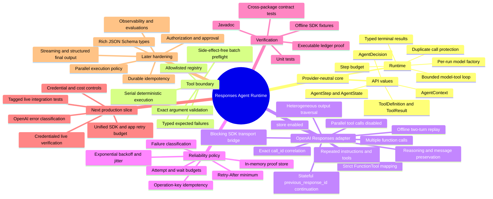
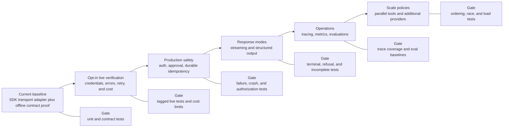

# Sustainable project mind map

[English](project-mind-map.md) | [简体中文](project-mind-map.zh-CN.md)

This map separates implemented capabilities from explicit extension points so the architecture can evolve without overstating readiness.

## Capability map

## Iteration path and quality gates

## Iteration contract

Every capability moves through the same lifecycle:

1. **Contract:** define provider-neutral behavior and failure states before selecting SDK shapes.
2. **Decision:** add or supersede an ADR when dependency direction, ownership, or irreversible semantics change.
3. **Implementation:** keep provider-specific types inside adapters and preflight before side effects.
4. **Proof:** add deterministic unit and contract tests; add live tests only behind explicit credentials and cost controls.
5. **Documentation:** update both languages, the architecture class catalog, the affected call path, and this capability map.
6. **Release gate:** report what the tests prove and what remains unverified.

## Definition of done by change type

| Change type | Minimum proof | Documentation impact |
| --- | --- | --- |
| Core API or runtime behavior | Unit tests, terminal/failure cases, immutable snapshots | Class diagram, class catalog, relevant ADR. |
| OpenAI protocol mapping | SDK fixture tests, unknown-item tests, exact ordering and `call_id` assertions | Responses sequence and protocol ADR. |
| Tool execution behavior | Preflight-with-zero-side-effect tests and execution-failure tests | Tool ADR and failure path. |
| Retry or idempotency | Pure policy boundary tests, conflict/failure cases | Reliability diagram and ADR. |
| Live integration | Explicit opt-in, credential isolation, bounded requests and costs | README scope, system context, verification boundary. |
| Parallel or distributed behavior | Race, ordering, partial failure, crash, and recovery tests | New ADR plus deployment/runtime diagrams. |

## Maintenance checklist

- Keep English and `.zh-CN.md` documents semantically equivalent.
- Treat the source tree and tests as behavior truth; treat diagrams as navigational models.
- Link class catalog rows to source files rather than copying implementation details.
- Mark future capabilities as future until executable evidence exists.
- Prefer adding a focused diagram or ADR over enlarging one diagram until it becomes unreadable.
- Review this map whenever a milestone changes from “next” to “implemented.”

## Related documents

- [Architecture, classes, and call paths](architecture.md)
- [Documentation index](README.md)
- [ADR directory](adr/0001-runtime-and-package-boundaries.md)
