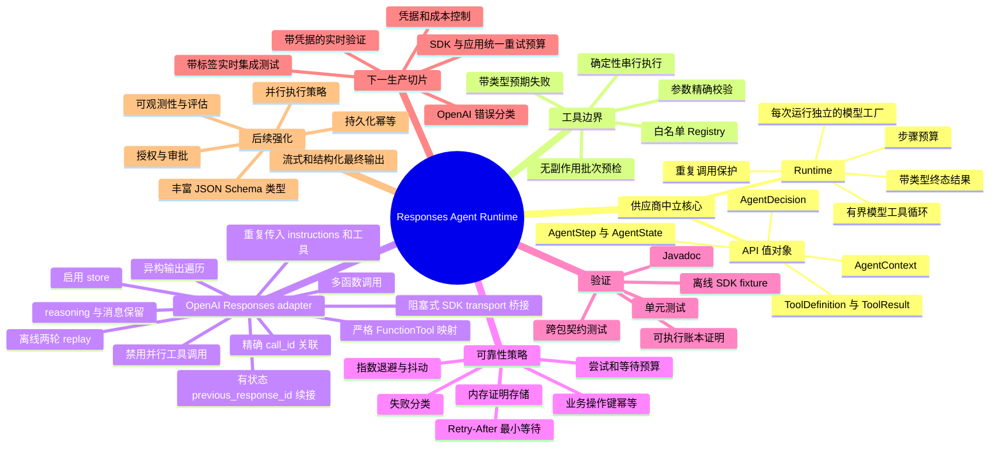
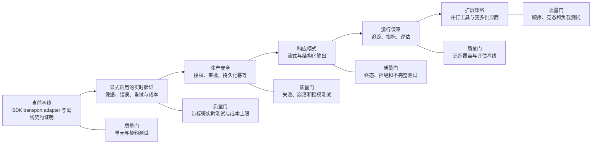

# 可持续迭代项目思维导图

[English](project-mind-map.md) | [简体中文](project-mind-map.zh-CN.md)

本图将已经实现的能力与明确的扩展点分开，使架构能够持续演进，同时避免夸大当前生产就绪程度。

## 能力地图

## 迭代路径与质量门

## 迭代契约

每项能力都经过相同生命周期：

1. **契约：**选择 SDK 类型前，先定义供应商中立行为和失败状态。
2. **决策：**依赖方向、所有权或不可逆语义变化时，新增 ADR 或声明取代已有 ADR。
3. **实现：**供应商专用类型只存在于 adapter 内，副作用前完成预检。
4. **证明：**增加确定性单元和契约测试；实时测试必须由显式凭据与成本控制启用。
5. **文档：**同步更新两种语言、架构类目录、受影响调用链和本能力地图。
6. **发布门：**明确报告测试证明了什么，以及仍未验证什么。

## 各类变更的完成定义

| 变更类型 | 最小证明 | 文档影响 |
| --- | --- | --- |
| 核心 API 或 Runtime 行为 | 单元测试、终态/失败案例、不可变快照 | 类图、类目录、相关 ADR。 |
| OpenAI 协议映射 | SDK fixture 测试、未知条目测试、精确顺序和 `call_id` 断言 | Responses 时序图和协议 ADR。 |
| 工具执行行为 | 预检失败时零副作用测试、执行失败测试 | 工具 ADR 和失败链路。 |
| 重试或幂等 | 纯策略边界测试、冲突/失败案例 | 可靠性类图和 ADR。 |
| 实时集成 | 显式启用、凭据隔离、有界请求和成本 | README 范围、系统上下文、验证边界。 |
| 并行或分布式行为 | 竞态、顺序、部分失败、崩溃和恢复测试 | 新 ADR 及部署/Runtime 图。 |

## 维护检查清单

- 保持英文和 `.zh-CN.md` 文档语义一致。
- 将源码与测试视为行为事实，将图视为导航模型。
- 类目录链接到源码文件，不复制容易过期的实现细节。
- 在出现可执行证据前，未来能力必须继续标注为未来能力。
- 优先增加聚焦的小图或 ADR，不要把单张图扩展到不可阅读。
- 每当某个里程碑从“下一步”变为“已实现”，必须复查本图。

## 相关文档

- [项目架构、类职责与调用链路](architecture.zh-CN.md)
- [文档索引](README.zh-CN.md)
- [ADR 目录](adr/0001-runtime-and-package-boundaries.zh-CN.md)
