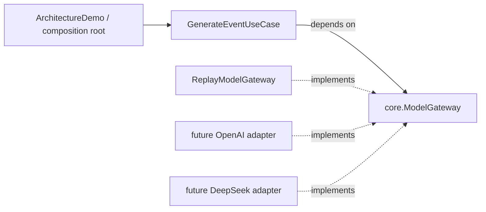

# ADR-001：供应商中立的 ModelGateway

- 状态：Accepted
- 日期：2026-08-28

## Context

应用需要在 OpenAI、DeepSeek、离线 Replay 和测试 Fake 之间替换模型实现，同时保持用例代码和离线测试稳定。外部 SDK 的请求类型、响应状态、流事件、错误结构和供应商能力会独立演进。Spring Modulith 将模块描述为“对外 API、内部实现、对其他模块 API 的引用”三部分，并支持验证模块结构；本项目用 Java 包和依赖方向落实同一原则，而不为此引入 Spring 运行时。

参考：[Spring Modulith Fundamentals](https://docs.spring.io/spring-modulith/reference/fundamentals.html)。

## Decision

应用核心定义最小出站端口 `ModelGateway`、命令 `ModelCommand` 和 sealed `ModelResult`。基础设施 adapter 实现端口，并把已识别的 transport、provider、protocol 故障翻译为 typed `ModelResult.Failed`。未知程序错误原样向上暴露。

依赖方向是基础设施指向核心。切换 Replay 场景或供应商只改变组合根中的注入，不修改 `GenerateEventUseCase`。

`ModelGatewayContractTest` 是所有 adapter 的共享语义测试：它验证 completed/refused/incomplete 类型保持可区分，三类 failure 不被压缩，且内容、原因和失败类别在映射后得到保留。

契约测试不能证明真实供应商的可用性、延迟、限流、计费、模型质量、事件顺序、重试安全性，也不能证明文档声称的 schema adherence 在特定模型版本上始终成立；这些需要供应商专属集成测试和线上观测。

## 被否决方案：应用层直接依赖 OpenAI SDK

该方案代码初期较少，但会让 OpenAI SDK 类型成为应用语言。SDK 升级会波及用例，DeepSeek 接入需要改写应用服务，离线测试也必须构造供应商对象；因此否决。

## Consequences

正面结果：核心可离线测试；Replay、Fake 和真实 adapter 可替换；终态及失败语义能被编译器区分；供应商 SDK 变化局限在 adapter。

代价：每个 adapter 都需要显式映射；最小公共模型无法暴露全部供应商能力；新增公共语义需要版本化审视端口与所有实现。契约测试只验证 adapter 的规范化输出，不代替真实 API 集成测试。

## 保留在 capability matrix 的能力

以下差异不塞进最小公共接口：严格 JSON Schema 支持及其 schema 子集、JSON mode 空内容行为、refusal 与 incomplete 的原生表达、流事件分类和顺序、工具调用与 strict tool schema、多模态、推理参数、token 限制、内建工具、限流和供应商错误码。

接入 OpenAI 与 DeepSeek adapter 时，第一项单独验证的是**结构化输出保证等级**：OpenAI `json_schema + strict` 声明提供 schema adherence（但只支持 JSON Schema 子集），DeepSeek JSON Output 文档只保证合法 JSON，并提示可能返回空内容。因此不能把“合法 JSON”当成“严格符合业务 schema”。参考：[OpenAI Responses API](https://platform.openai.com/docs/api-reference/responses-streaming/response/output_item)、[DeepSeek JSON Output](https://api-docs.deepseek.com/guides/json_mode/)。

## 架构评审

- 核心是否依赖基础设施？否。`core` 仅定义端口、用例和中立数据类型；基础设施依赖核心。
- 端口是否泄漏 SDK 类型？否。签名中只有项目类型和 JDK 类型。
- 失败语义是否被压缩成一个异常？否。`Refused`、`Incomplete`、`Failed` 可区分，`Failed` 继续区分 transport/provider/protocol；未知程序错误不伪装成预期失败。
- adapter 是否包含本应属于应用层的策略？否。Replay 只选择和返回记录结果，结构化解析 adapter 只做格式映射；重试、降级、预算和用户提示仍由应用层决定。

