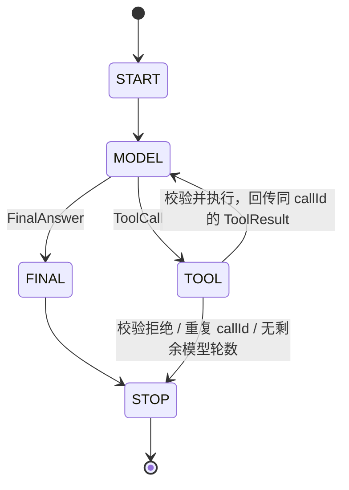

# W2D1：最小离线 Agent Runtime

日期：2026-08-31。范围：一次模型决策返回一个 ToolCall 或 FinalAnswer；工具串行执行；不使用真实模型、网络、API Key、重试、并行工具或持久化。

## 阅读与复答

1. Tool calling flow 是什么？应用把可用工具交给模型，接收工具调用，在应用侧执行，再把工具输出送回模型；模型可以最终回答，也可以继续请求工具。工具调用不是“模型已经执行了函数”。[OpenAI Function Calling：Tool calling flow](https://developers.openai.com/api/docs/guides/function-calling#the-tool-calling-flow)
2. ToolResult 为什么必须保留 callId？它标识结果属于哪次调用，不能用工具名代替（同一工具可能调用多次），也不能重新生成 ID。官方示例把调用的 call_id 原样放进 function_call_output。第二次模型请求还需要保留调用上下文，而不只是孤立结果。[OpenAI Function Calling：Tool call outputs 与关联示例](https://developers.openai.com/api/docs/guides/function-calling)
3. ReAct 带来的设计启发是什么？论文摘要与流程图把推理、行动、环境观察交替连接；观察会影响后续决策。本实现只借用“决策 → 行动 → 观察 → 再决策”的工程结构，不声称复现论文实验，不采集或强制输出模型内部推理。[ReAct 摘要](https://arxiv.org/abs/2210.03629)、[作者项目页与流程图](https://react-lm.github.io/)
4. 谁决定再问模型还是停止？Runtime。ToolResult 是观察数据，不是最终答案；只有收到 FinalAnswer 才进入 FINAL，再正常 STOP。达到限制或校验拒绝则返回带明确原因的 Stopped，不伪装成成功。

## 最小状态图



复答速记：`START → MODEL → TOOL/FINAL → MODEL/STOP`。

图中的 TOOL 包含执行前校验，进入 TOOL 不表示工具已经执行。未知 model/tool 编程错误直接抛出，不会被转换成“网络失败”或正常 Stopped。上述图表示正常返回及已识别停止分支，不把未知异常包装成状态结果。

## 核心类型与调用边界

- `AgentState`：START、MODEL、TOOL、FINAL、STOP。
- `AgentDecision`：sealed `FinalAnswer(text)` / `ToolCall(callId, toolName, arguments)`。
- `AgentModelPort.decide(AgentContext)`：每次只作一次决策。
- `AgentContext`：不可变的原始输入、工具定义、调用/结果历史；`Exchange` 强制调用与结果的 callId 一致。
- `ToolDefinition`：本版所有参数都是必填、非空字符串；暂不支持可选、数字、数组和嵌套对象。真实 adapter 将来必须检查参数类型，不能把任意 JSON 值静默转成字符串。
- `ToolRegistry`：allowlist、精确参数字段集合、非空参数检查、分发；构造 `ToolResult` 时复制原 callId。注册重复工具名立即报错。
- `ToolHandler.execute(arguments)`：只返回该工具的输出数据，不能改写 callId。
- `AgentRuntime`：循环、上下文、轨迹、轮数上限、重复 callId 防护、终止结果。达到最后一个模型轮次后若仍返回 ToolCall，不执行这个没有后续轮次消费结果的工具。

核心仅依赖 JDK。`AgentRuntimeDemo` 是组合根，注入 `ReplayAgentModel` 与 `ReplayOrderTool`；model adapter 不引用 registry，也不执行工具。每次 run 的历史和轮数都是独立的，Replay model 无递增全局游标。

## 单工具回合的实测轨迹

| 步骤 | 状态 / 事件 | 证据 |
| --- | --- | --- |
| 0 | START | 输入订单查询 |
| 1 | MODEL | 提供原输入和 lookup_order 定义，history 为空 |
| 2 | TOOL / ToolCall | callId=call_order_001，orderId=ORD-001 |
| 3 | ToolResult → MODEL | 同一 callId，输出 Order ORD-001: SHIPPED；历史保留调用和结果 |
| 4 | FINAL | Replay answer: Order ORD-001: SHIPPED |
| 5 | STOP | 正常结束，不再次调用模型或工具 |

## 职责与禁止越界

| 组件 | 拥有的责任 | 禁止越界项 |
| --- | --- | --- |
| Runtime（核心编排） | 驱动循环、维护历史/轨迹、轮数预算、执行前防护、决定继续或停止 | 不导入供应商 SDK；不解析供应商 JSON；不直接实现工具操作 |
| Model adapter | 把一次模型请求/响应转换为中立上下文与决策；保留 callId；将来维护供应商专属协议续接信息 | 不自行循环、不执行工具、不擅自重试或修改应用预算、不把 ToolCall 伪装成 FinalAnswer |
| Tool adapter | 执行一次已校验工具操作，返回业务数据 | 不调用模型、不控制循环、不改写 callId、不把工具数据当最终用户答案 |
| Registry（核心分发） | 名称 allowlist、参数契约校验、选择 handler、关联结果 | 不让模型指定任意类/函数执行；不跳过校验；不决定应用重试策略 |

这里的参数校验只覆盖已声明的最小契约，不等于授权或完整业务校验。未来有副作用工具时仍需增加授权、幂等、超时和审计；仅靠 callId 去重不是跨进程 exactly-once 保证。拒绝、未完成、预期供应商故障、工具业务失败、流式及并行调用也不在本次两分支决策模型内，后续应显式扩展，不能压进 FinalAnswer。

## 编译与运行证据

在项目根目录执行：

```powershell
mvn -o test
java -cp target/classes com.pickagent.w2d1.AgentRuntimeDemo
```

实测 Maven 输出节选（保留原有编译配置，本轮未修改 pom）：

```text
Compiling 46 source files with javac [debug target 17] to target\classes
Compiling 14 source files with javac [debug target 17] to target\test-classes
Running com.pickagent.w2d1.core.AgentRuntimeTest
Tests run: 12, Failures: 0, Errors: 0, Skipped: 0
Tests run: 62, Failures: 0, Errors: 0, Skipped: 0
BUILD SUCCESS
```

原有 50 个测试保留，新增 12 个：完整回合/关联与上下文、直接回答、未知工具、缺少参数、额外参数、空参数、重复 callId、轮数限制、模型编程错误、工具编程错误、关联 ID 不匹配、重复注册。

此外，用 `javac --release 17 -encoding UTF-8 -proc:none` 指定空 classpath/sourcepath，仅编译 core 目录中的 10 个文件，编译退出码 0。它证明当前核心无需 SDK 或基础设施类也能编译，不只依赖 import 文本扫描。

```text
JDK_ONLY_CORE_COMPILE_OK: 10 source files, no external classpath
TRACE: START -> MODEL -> TOOL -> MODEL -> FINAL -> STOP
ToolCall: callId=call_order_001, tool=lookup_order, arguments={orderId=ORD-001}
ToolResult: callId=call_order_001, output=Order ORD-001: SHIPPED
FinalAnswer: Replay answer: Order ORD-001: SHIPPED
DEMO_EXIT_CODE=0
OFFLINE_AND_SDK_SCAN_OK
```

默认测试未启用 integration，测试/Demo 无真实模型请求；文档阅读使用网络检索，与离线运行相互独立。
